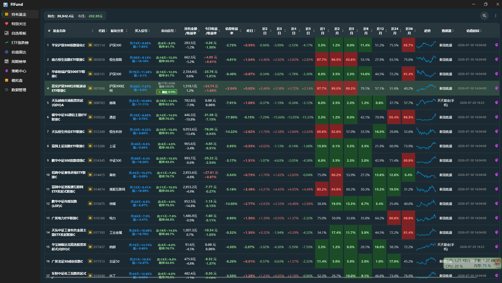
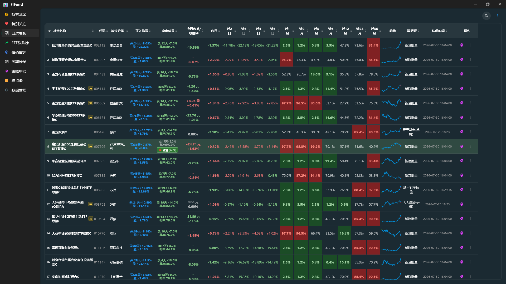
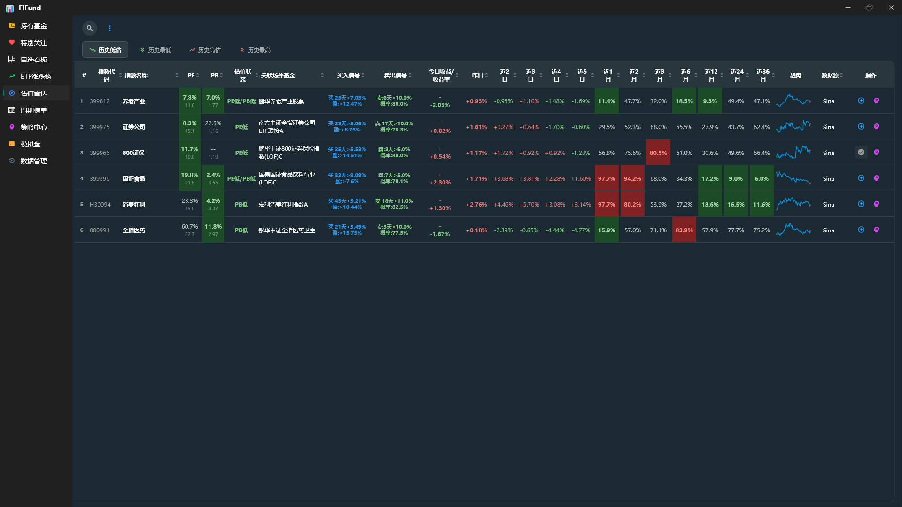
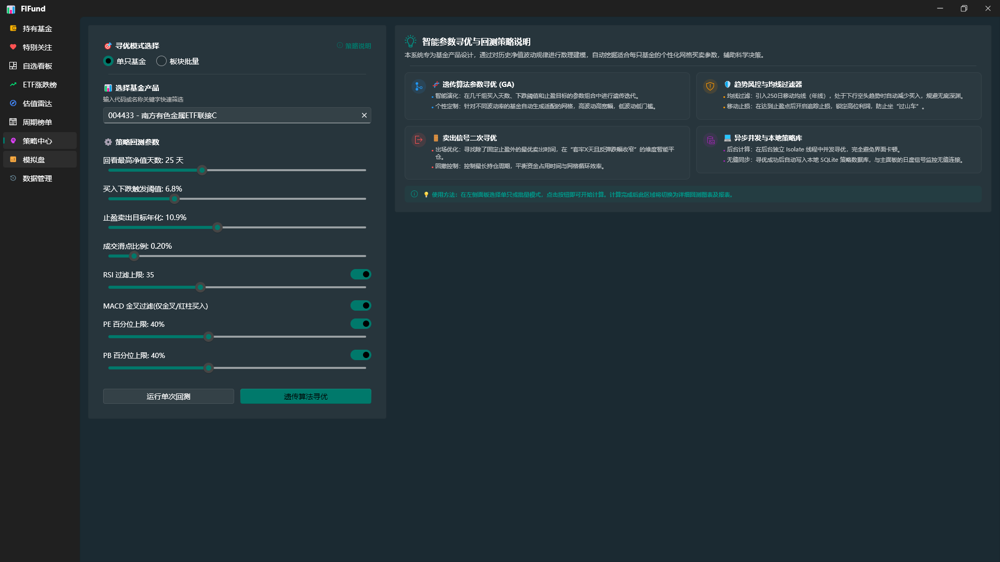
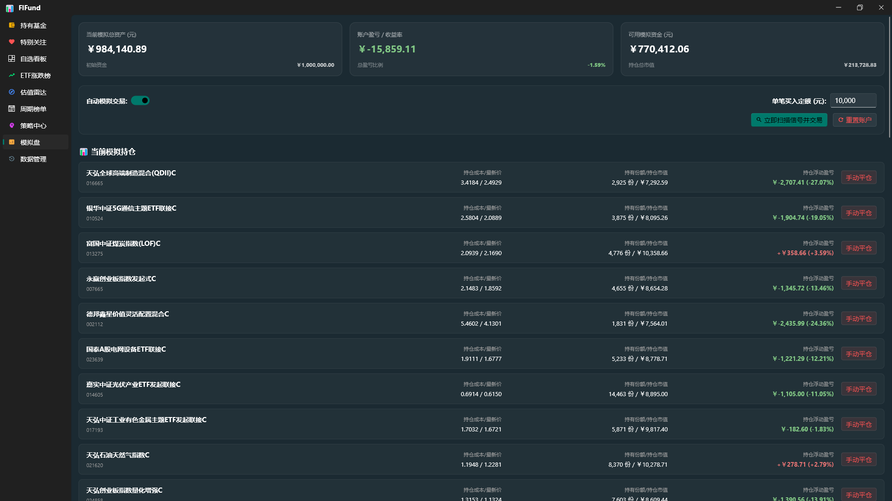

# FlFund (基金分析与策略回测系统)

[](pubspec.yaml)
[](#)

`FlFund` 是一个基于 Flutter 开发的跨平台基金分析、持有管理与策略回测系统。项目界面采用 Fluent UI 风格设计，支持 Windows 桌面无边框体验与移动端自适应布局。同时，项目在 Windows 环境下运行时支持读取并迁移原 Python 基金软件的历史数据库，保障数据无缝衔接。

---

## 📸 功能截图

### 持有基金
资产统计、盈亏计算与买卖点标记，支持多选批量操作与上下文菜单。



### 自选看板
自选基金实时估值看板，内置迷你趋势图与搜索定位。



### 估值雷达
指数 PE/PB 百分位估值监测，自动标记高低估状态与关联场外基金。



### 策略中心
策略回测与遗传算法参数寻优结果展示，支持交互式回测图表。



### 模拟盘
信号驱动的模拟交易引擎，提供组合资产追踪与完整交易流水。



---

## 🌟 核心特性

### 1. 策略回测与参数寻优 (Core Engine)
* **高性能回测引擎**：在 [backtest_engine.dart](lib/core/backtest_engine.dart) 中实现了基金交易策略回测，利用单调双端队列 $O(n)$ 算法重构滑动窗口求最大值，显著提升高频计算效率。
* **遗传算法寻优 (GA)**：在 [ga_optimizer.dart](lib/core/ga_optimizer.dart) 中实现了交易策略参数的自动寻优工具，支持批量多任务寻优。
* **卖出信号寻优器**：新增卖出信号寻优器（`SellSignalOptimizer`），基于穷举法计算特定持有天数与涨幅阈值下的卖出高胜率参数，支持本地持久化并提供“💥 触发”高亮徽章提醒。
* **交互式回测图表**：回测趋势折线图支持悬停交互，直观显示指定日期的净值以及买点/卖点数值。

### 2. 多维度基金与持仓管理 (Portfolio Management)
* **智能导入与大模型 OCR 识别**：[add_holding_dialog.dart](lib/ui/widgets/add_holding_dialog.dart) 提供手动搜索输入与截图 OCR 识别双重导入模式。OCR 识别支持配置智谱 AI (`glm-4.6v-flash`) 及 DeepSeek 等多模态模型，支持优先匹配 C 类基金，并通过模糊拼音匹配算法（LCS）匹配本地基金代码。
* **批量导入与更新**：提供自选基金批量导入功能（[import_my_funds_dialog.dart](lib/ui/widgets/import_my_funds_dialog.dart)），支持仅更新缺失信息而不覆盖现有持仓。
* **多选与置顶操作**：提供表格多选批量删除及“更多操作”上下文菜单（包括置顶、特别关注、板块分类等）。

### 3. 并发数据网关 (Data Gateway)
* **双源 API 分流**：在 [data_gateway.dart](lib/core/data_gateway.dart) 中实现了实时估值请求的奇偶分流逻辑（天天基金与腾讯财经），规避单 IP 高频并发被封禁风险。
* **数据源友好展示**：自动处理抓取异常并提供界面详情弹窗提醒。

### 4. 模拟交易 (Paper Trading)
* **信号驱动自动交易**：在 [simulation_provider.dart](lib/core/simulation_provider.dart) 中实现了基于策略信号的模拟交易引擎，支持尾盘估值信号与收盘净值信号自动触发买入/卖出操作，并记录信号来源。
* **四重平仓保护**：固定止损(-15%) + 目标止盈(策略参数) + 到期平仓(hold_max) + 卖出信号，与回测引擎逻辑完全对齐。
* **网格加仓**：持仓基金继续下跌超过网格间距时自动追加买入摊低成本（最多3次），与回测引擎的多仓位网格逻辑对齐。
* **仓位管控**：全局最大持仓25只、单日最多买入5笔、同日买卖互斥，防止集中建仓和无效交易。
* **组合资产追踪**：提供总资产、持仓市值、可用现金、总盈亏及收益率的实时统计面板。
* **手动操作与交易流水**：支持手动买入/卖出，完整记录每笔交易的价格、份额、金额及信号原因。
* **云端同步**：模拟组合数据通过 Supabase 实现跨设备同步持久化。

### 5. 现代化 UI/UX (Fluent UI)
* **界面自适应与折叠**：支持桌面端无边框窗口拖拽及系统控制，移动端支持小屏侧边栏折叠及长按操作菜单。
* **性能绘制优化**：为自选/持仓列表中的迷你趋势图（[sparkline.dart](lib/ui/widgets/sparkline.dart)）添加 `RepaintBoundary`，极大降低页面高频渲染时的 CPU 重绘开销。
* **全局快捷键**：支持快捷键 `F5` / `Ctrl+R` 强制刷新数据，`Ctrl+F` 自动聚焦并定位到当前表格的搜索框。
* **板块网格修正**：支持 40+ 细分行业板块，并可通过抓取基本概况异步网络修正“其它”等模糊板块分类。
* **数据备份与恢复**：提供本地配置及数据库文件的导入与导出功能，防止数据丢失（[backup_tab.dart](lib/ui/tabs/backup_tab.dart)）。

---

## 🌐 外部平台与 API 依赖

本系统部分核心功能的运行依赖于以下外部服务及 API，您可以在系统设置中根据自身需求进行配置：

### 1. 多模态大模型 (OCR 智能识别)
用于对导入的持仓截图进行智能 OCR 识别及字段（基金代码、持有金额、收益率等）的提取。
* **默认模型**：智谱 AI `glm-4.6v-flash`（接口地址：`https://open.bigmodel.cn/api/paas/v4`）
* **支持模型**：智谱 AI、DeepSeek 等兼容 OpenAI 格式的多模态大模型。
* **配置管理**：支持在应用设置（对应 [config.dart](lib/core/config.dart)）中自定义大模型的 API Key、API URL 及模型名称。

### 2. 基金数据 API (数据网关)
系统自动从公开财经接口获取基金历史净值、实时估值及基本信息。在数据网关 [data_gateway.dart](lib/core/data_gateway.dart) 中实现了分流与降级策略：
* **天天基金网 (EastMoney)**：
  * 历史净值 API：`fundmobapi.eastmoney.com`
  * 实时估值 API：`fundgz.1234567.com.cn`
  * 基金概况 (板块修正)：`fundf10.eastmoney.com`
* **腾讯财经 (Tencent)**：
  * 实时估值 API：`qt.gtimg.cn`（与天天基金交替进行奇偶分流请求，规避单 IP 并发过高被封禁的风险）
* **新浪财经 (Sina)**：
  * 降级数据 API：`hq.sinajs.cn` (提供批量实时估值)

### 3. 云端存储与数据同步 (Supabase)
系统除了使用本地 SQLite 存储（对应 [db_manager.dart](lib/core/db_manager.dart)）外，还支持云端备份与跨端同步：
* **平台支持**：Supabase 后端即服务 (BaaS)
* **默认配置**：系统预设了公共演示数据库实例，可在多设备间无感同步。
* **隔离与自定义**：支持用户在设置中填入自己申请的 Supabase URL 和 Anon Key，实现数据完全私有化与完全物理隔离存储。

---

## 📂 项目结构

```text
lib/
├── core/                              # 核心业务逻辑层
│   ├── models/
│   │   └── fund_info.dart             # 基金信息数据模型
│   ├── utils/
│   │   ├── number_formatter.dart      # 数字格式化工具（千分位、百分比）
│   │   ├── ocr_service.dart           # 多模态大模型 OCR 识别服务
│   │   ├── pinyin_search.dart         # 拼音模糊搜索与C类权重匹配
│   │   └── theme_colors.dart          # 主题颜色定义
│   ├── backtest_engine.dart           # 策略回测核心引擎
│   ├── config.dart                    # 应用配置文件读写（临时原子写入）
│   ├── data_gateway.dart              # 网络数据抓取（天天基金 / 腾讯财经分流）
│   ├── db_manager.dart                # 本地 SQLite 跨平台数据库管理（Windows/Android）
│   ├── fund_provider.dart             # 基金状态分发、表格排序与列配置
│   ├── ga_optimizer.dart              # 遗传算法参数寻优
│   ├── simulation_provider.dart       # 模拟交易状态管理（信号触发、组合计算）
│   └── supabase_manager.dart          # Supabase 云端连接与认证管理
├── ui/                                # 界面交互层
│   ├── tabs/                          # 功能页签
│   │   ├── backup_tab.dart            # 数据备份恢复
│   │   ├── cycle_board_tab.dart       # 周期看板
│   │   ├── holding_tab.dart           # 持有基金（资产统计、盈亏计算、买卖点标记）
│   │   ├── my_funds_tab.dart          # 自选基金看板
│   │   ├── ranking_tab.dart           # 领涨/领跌板块排行
│   │   ├── simulation_tab.dart        # 模拟交易（信号自动交易、组合资产面板）
│   │   ├── special_attention_tab.dart # 特别关注看板
│   │   ├── strategy_center_tab.dart   # 策略中心（寻优结果、回测图表）
│   │   └── valuation_tab.dart         # 估值中心（指数雷达、高低估筛选）
│   ├── widgets/                       # 通用 UI 组件
│   │   ├── add_holding_dialog.dart    # 持仓导入弹窗 (OCR 识别/大模型)
│   │   ├── copyable_text.dart         # 可复制文本组件
│   │   ├── expandable_search_box.dart # 可展开搜索框（快捷键聚焦）
│   │   ├── fund_chart_dialog.dart     # 趋势图折线图弹窗
│   │   ├── holding_dialog.dart        # 持仓详情弹窗
│   │   ├── import_my_funds_dialog.dart# 自选批量导入弹窗
│   │   ├── mobile_header.dart         # 移动端页头适配
│   │   ├── paste_helper.dart          # 粘贴辅助工具
│   │   ├── scaled_checkbox.dart       # 缩放复选框
│   │   ├── sparkline.dart             # 重绘优化的趋势迷你图
│   │   ├── splash_screen.dart         # 启动屏幕
│   │   └── unoptimized_badge.dart     # 未寻优提示徽章
│   └── main_window.dart               # 主窗口布局（侧边栏、Tab 页签分发）
└── main.dart                          # 应用入口与全局默认字体/亮暗主题配置
screenshots/                           # README 功能截图
├── holdings.png                       # 「持有基金」页面截图
├── simulation.png                     # 「模拟盘」页面截图
├── strategy.png                       # 「策略中心」页面截图
├── valuation.png                      # 「估值雷达」页面截图
└── watchlist.png                      # 「自选看板」页面截图
```

---

## 🚀 快速开始

### 运行环境要求
* Flutter SDK `3.4.0` 或更高版本
* Dart SDK `>=3.4.0 <4.0.0`
* 操作系统支持：Windows 10+, Android 5.0+

### 获取依赖
在项目根目录下执行：
```bash
flutter pub get
```

### 运行应用
* **运行 Windows 桌面版**：
  ```bash
  flutter run -d windows
  ```
* **运行 Android 移动端**：
  ```bash
  flutter run -d android
  ```

